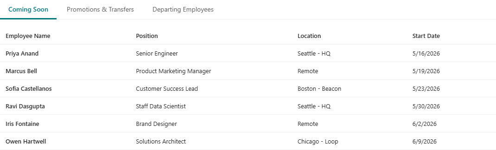
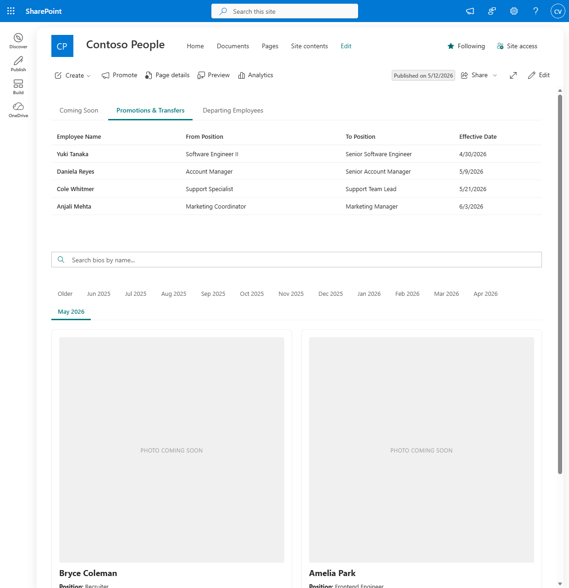
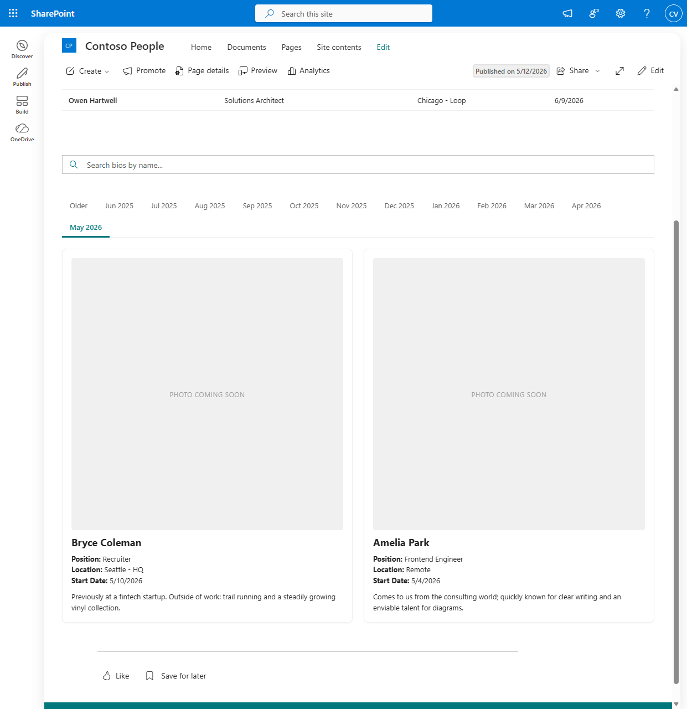
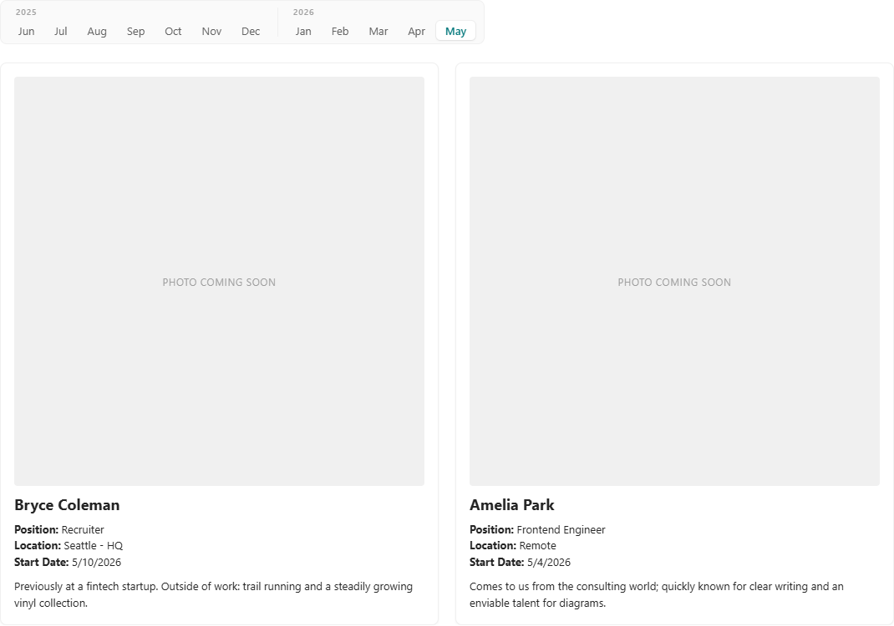

# PnP Modern Search templates

Three Handlebars templates for the [PnP Modern Search](https://microsoft-search.github.io/pnp-modern-search/) Search Results web part. The first two render a trailing-twelve-months tab strip whose labels and routing rules are recomputed from `new Date()` every time the page renders, so an HR page that used to need a monthly edit just keeps working. The third is a top-of-page strip with three fixed buckets (Coming Soon / Promotions & Transfers / Departing Employees) evaluated against `today` at render time.

I wrote up the why and the gotchas [in the post](https://charlie.tools/posts/pnp-search-trailing-month-tabs). This README is the operator's manual.

## What's in here

### `templates/trailing-months-bios.html`

A card grid for "employees joining" / new-hire bios, with a flat tab strip:

```
Older | Jun 2025 | Jul 2025 | … | Apr 2026 | May 2026
```

Newest month is on the right and is the default tab. An "Older" bucket catches anything past the trailing window. A connected Search Box hides the tabs and shows every matching card across all months via a `[data-search*="query" i]` selector. Tab switching is hidden `<input type="radio">` plus `:checked ~` sibling rules. No JavaScript.

### `templates/trailing-months-bios-grouped.html`

Same recipe, denser layout. The twelve months split into two year columns:

```
[ 2025 ]                              [ 2026 ]
  Jun  Jul  Aug  Sep  Oct  Nov  Dec   | Jan  Feb  Mar  Apr  May
```

Each column iterates the same twelve-duration list and only renders months whose `YYYY` matches its header. The previous-year column auto-hides via `:empty` on the one month a year when all twelve trailing months happen to land in the same calendar year.

This variant also cross-fades on tab switch, both directions, in ~180ms. Exiting cards fade down and out, entering cards fade in from a 4px offset.

Important caveat on the cross-fade: don't reach for top-level `@keyframes` here. PnP's template service prefixes every top-level rule with the web part's `#pnp-template_<guid>` id, which makes `@keyframes` invalid CSS and the browser silently drops it. The animation reference still parses but has no body to animate against. The workaround in this template is [`@starting-style`](https://developer.mozilla.org/en-US/docs/Web/CSS/@starting-style) nested inside the per-month rules, plus [`transition-behavior: allow-discrete`](https://developer.mozilla.org/en-US/docs/Web/CSS/transition-behavior) on `display`. Nested at-rules ride along inside their parent selector and survive the scoper.

The "Older" bucket is dropped from this variant. If you need it back, the flat version keeps it.

### `templates/employment-updates-tabs.html`

A top-of-page tab strip with three fixed tabs evaluated against `today` at render time:

- **Coming Soon** — future `EffectiveDate`
- **Promotions & Transfers** — within ±45 days of today
- **Departing Employees** — within ±45 days of today

Layout uses CSS-grid `<div>` rows instead of `<table><tr>`. PnP runs DOMPurify over every rendered template, and a `<table>` body that's been through Handlebars `{{#each}}` plus DOMPurify's re-parse loses its iterated rows; the browser's "in table" insertion mode foster-parents anything that doesn't fit and the rows disappear. Plain divs don't trigger any of that. Same visual layout, no surprises.

## How to use

Drop the HTML file you want into a SharePoint document library, then point a PnP Modern Search **Search Results** web part at it:

- **Layout** → External template URL
- **External template URL** → the SharePoint URL of the file you uploaded

The templates expect items in `data.items` with these field names:

| Field           | Type    | Used by                                          |
| --------------- | ------- | ------------------------------------------------ |
| `Title`         | string  | Display name (all three templates)               |
| `EffectiveDate` | date    | Month bucketing and date-window filters          |
| `Position`      | string  | Card meta and table column                       |
| `Location`      | string  | Card meta and table column                       |
| `NewPosition`   | string  | Promotions tab only                              |
| `EntryType`     | string  | Top-tabs bucket: `Coming Soon`, `Promotion`, `Departure` |
| `Retiring`      | boolean | Departures tab — renders a "Retiring" badge      |
| `Narrative`     | HTML    | Bios card body                                   |
| `PhotoUrl`      | URL     | Bios card image                                  |

Easiest way to land that shape: point the web part at a SharePoint list whose column internal names match. Any data source the web part supports works — SharePoint Search, Microsoft Search, or a custom extensibility library. The templates don't care.

## Demo

Screenshots are from a fictional `Contoso People Updates` list:







## Versions

Targets PnP Modern Search 4.21.0+. The `subtract='1 month'` syntax in the date math relies on the rewritten `helperMomentCompat`, which whitespace-splits the hash value and forwards the parts to dayjs. On 4.19.1 the same string is passed straight to moment.js, which doesn't recognise `"1 month"` as a valid duration and silently returns the original date — every tab would be the same month. ISO 8601 strings like `P1M` work on 4.19.1 but break on 4.21 (`Number("P1M")` is `NaN`). There's no portable duration string. Pick a tenant on 4.21 or upgrade.

The active-tab indicator uses CSS [`:has()`](https://developer.mozilla.org/en-US/docs/Web/CSS/:has) — shipped in all four major browsers by late 2023. The grouped variant's cross-fade additionally needs `@starting-style`, `transition-behavior: allow-discrete`, and CSS nesting, all in Chrome / Edge 117+ and Safari 17.5+. SharePoint Online runs on modern Chromium and these all work; if you need to support older targets, drop the cross-fade rules and the rest of the template still renders fine.

## License

[MIT](LICENSE)
